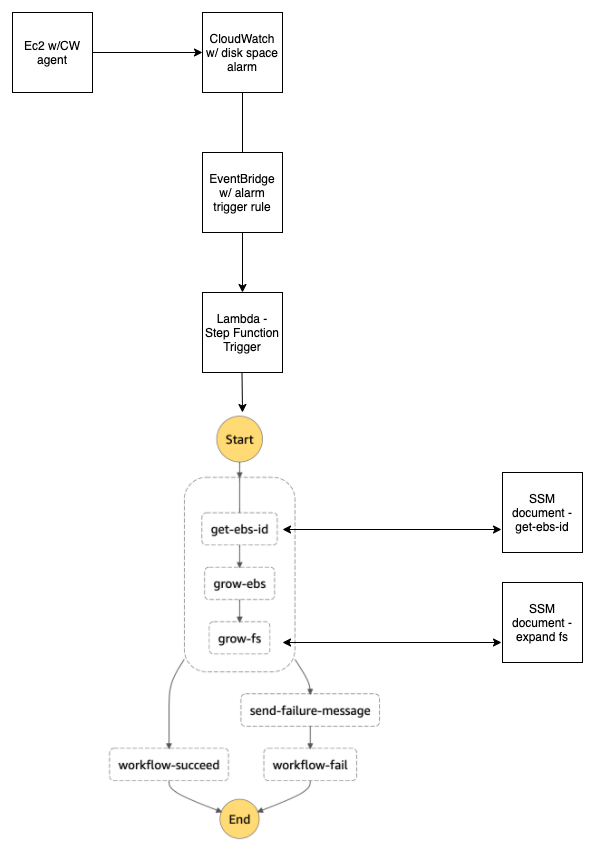

# Detect and grow EBS volumes and associated OS file system

This solutions shows uses the components referenced below to  
|Component|Use|
|----|-----|
|Cloudwatch Agent|sends cloudwatch metrics|
|Cloudwatch Alarm|trigger threshold alarm based alarm for file system|
|Eventbridge|watching for specific alarm to trigger lambda|
|Lambda - auto01-stepfunc-trigger|triggers step function|
|Step Function|controls lambda flow and error handling|
|Lambda - auto01-get-ebs-id|gets EBS ID from associated mountpoint - uses SSM document|
|Lambda - auto01-grow-ebs|snapshots EBS volume then grows|
|Lambda - auto01-grow-efs|grows OS partition and file system - uses SSM document|

## Installation

```bash
Infrasture Code Coming Soon
```

## Architecture Overview


